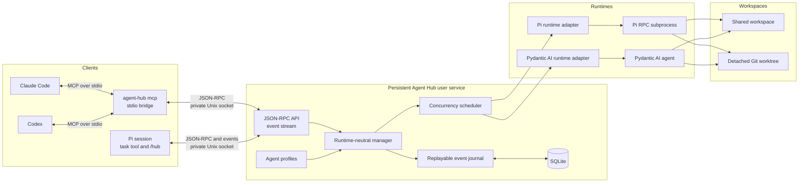

# Agent Hub

Agent Hub is a local control plane for coding agents. It schedules Pi and Pydantic AI runs, persists lifecycle events, and exposes JSON-RPC over a user-owned Unix socket.

## Architecture



The Pi extension transports commands and renders state. The persistent manager owns scheduling, recovery, event replay, and runtime processes, so agents continue when an individual Pi session closes.

## Install

```bash
uv run agent-hub install
```

This command installs the bundled Pi extension and starts a persistent user service. It writes a LaunchAgent on macOS or a user systemd service on Linux.

Restart Pi after installation. The extension provides the `task` tool and the `/hub` command.

To remove the service and extension:

```bash
uv run agent-hub uninstall
```

## Claude Code and Codex

Agent Hub exposes a local MCP server over stdio. The bridge forwards tool calls to the persistent daemon through its private Unix socket.

Configure Claude Code in your project's `.mcp.json`:

```json
{
  "mcpServers": {
    "agent-hub-my-project": {
      "command": "agent-hub",
      "args": ["mcp"]
    }
  }
}
```

Configure Codex with the same command:

```bash
codex mcp add agent-hub-my-project -- agent-hub mcp
```

Use a project-specific server name. Restart the client after changing its MCP configuration. The server provides `task`, `agent_list`, `agent_get`, `agent_stop`, `agent_abort`, `run_get`, and `run_wait`.

The MCP process uses its working directory for delegated agents. Run `agent-hub install` first so the persistent daemon is available.

## Run without a service

```bash
uv run agent-hub
```

The service listens on `~/.agent-hub/run/agent-hub.sock`. It runs Uvicorn with `zttp` for HTTP parsing and `zuvloop` for the event loop. Python clients and tests use `httpx2`.

## Profiles

Create user profiles under `~/.config/agent-hub/agents/`:

```toml
name = "reviewer"
runtime = "pi"
model = "anthropic/claude-sonnet-4"
access = "read-only"
keep_alive = false
max_runtime_seconds = 900
```

Project profiles under `.agent-hub/agents/` require an explicit opt-in:

```bash
uv run agent-hub install --allow-project-profiles
```

Project profiles override user profiles with the same name. Keep-alive profiles must set a bounded `idle_timeout_seconds`.

A Pydantic AI profile can select manager-owned workspace tools and named MCP servers:

```toml
name = "pydantic-coder"
runtime = "pydantic-ai"
model = "anthropic:claude-sonnet-4-6"
access = "shared-write"
tools = ["read_file", "list_files", "write_file"]
mcp_servers = ["https://localhost:8000/mcp"]
allow_delegation = false
max_runtime_seconds = 900

[usage_limits]
request_limit = 30
total_tokens_limit = 100000
```

The built-in `read_file` and `list_files` tools are available to read-only profiles. `write_file` requires `shared-write` access. URL and script-based MCP servers require Pydantic AI's MCP optional dependency. You can also inject preconfigured MCP toolsets when embedding `create_app()`.

## Workspace isolation

Pass `isolated: true` to the `task` tool to run an agent in a detached Git worktree. Use `/hub` to inspect the resulting patch, apply it explicitly, or discard the worktree. Agent Hub never applies isolated changes automatically.

## Development

```bash
uv sync
uv run pytest
cd extension && npm install && npm run check && npm test
```

Run the installed-Pi process check without contacting a model provider:

```bash
uv run pytest -m installed_pi tests/test_installed_pi.py
```

See [`PLAN.md`](PLAN.md) for the protocol and architecture.
