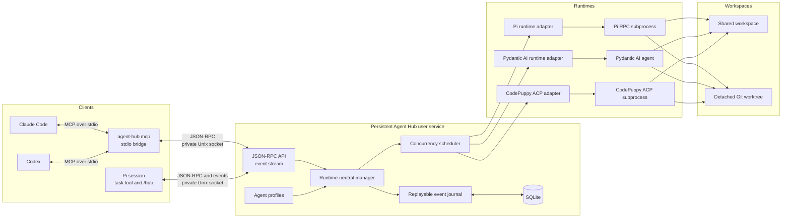

# Agent Hub

Agent Hub is a local control plane for coding agents. It schedules Pi, Pydantic AI, and CodePuppy runs, persists lifecycle events, and exposes JSON-RPC over a user-owned Unix socket.

## Architecture



The Pi extension transports commands and renders state. The persistent manager owns scheduling, recovery, event replay, and runtime processes, so agents continue when an individual Pi session closes.

## Install

Install the wheel published by the [`Kludex/agent-hub`](https://github.com/Kludex/agent-hub) release workflow:

```bash
pipx install --python python3.14 \
  https://github.com/Kludex/agent-hub/releases/download/v0.1.0/agent_hub-0.1.0-py3-none-any.whl
agent-hub install
```

The release includes `SHA256SUMS` for artifact verification. `agent-hub install` installs the bundled Pi extension and starts a persistent user service. It writes a LaunchAgent on macOS or a user systemd service on Linux.

Restart Pi after installation. The extension provides the `task` tool and the `/hub` command.

To remove the service and extension:

```bash
agent-hub uninstall
pipx uninstall agent-hub
```

## Claude Code and Codex

Agent Hub exposes a local MCP server over stdio. The bridge forwards tool calls to the persistent daemon through its private Unix socket.

Configure Claude Code in your project's `.mcp.json`:

```json
{
  "mcpServers": {
    "agent-hub-my-project": {
      "command": "agent-hub",
      "args": ["mcp"]
    }
  }
}
```

Configure Codex with the same command:

```bash
codex mcp add agent-hub-my-project -- agent-hub mcp
```

Use a project-specific server name. Restart the client after changing its MCP configuration. The server provides `task`, `agent_list`, `agent_get`, `agent_stop`, `agent_abort`, `run_get`, and `run_wait`.

The MCP process uses its working directory for delegated agents. Run `agent-hub install` first so the persistent daemon is available.

## Run without a service

```bash
agent-hub serve
```

The service listens on `~/.agent-hub/run/agent-hub.sock`. It runs Uvicorn with `zttp` for HTTP parsing and `zuvloop` for the event loop. Python clients and tests use `httpx2`.

## Agent catalog

Browse and install curated profiles from the built-in Agent Hub registry:

```bash
agent-hub catalog
agent-hub catalog search planning
agent-hub catalog show agent-hub/implementation-planner
agent-hub catalog install agent-hub/implementation-planner
agent-hub agent list
```

Agent Hub verifies the bundle and displays its permissions and external dependencies before installation. Installed versions stay pinned until you run `agent-hub agent update <owner>/<name>`. See [Agent catalog](docs/catalog.md) for source management, permission-aware updates, and registry publishing.

## Profiles

Create user profiles under `~/.config/agent-hub/agents/`:

```toml
name = "reviewer"
runtime = "pi"
model = "anthropic/claude-sonnet-4"
access = "read-only"
keep_alive = false
max_runtime_seconds = 900
```

Project profiles under `.agent-hub/agents/` require an explicit opt-in:

```bash
agent-hub install --allow-project-profiles
```

Project profiles override user profiles with the same name. User and opted-in project profiles also override installed catalog profiles identified by `<owner>/<name>`. Keep-alive profiles must set a bounded `idle_timeout_seconds`.

A Pydantic AI profile can select manager-owned workspace tools and named MCP servers:

```toml
name = "pydantic-coder"
runtime = "pydantic-ai"
model = "anthropic:claude-sonnet-4-6"
access = "shared-write"
tools = ["read_file", "list_files", "write_file"]
mcp_servers = ["https://localhost:8000/mcp"]
allow_delegation = false
max_runtime_seconds = 900

[usage_limits]
request_limit = 30
total_tokens_limit = 100000
```

The built-in `read_file` and `list_files` tools are available to read-only profiles. `write_file` requires `shared-write` access. URL and script-based MCP servers require Pydantic AI's MCP optional dependency. You can also inject preconfigured MCP toolsets when embedding `create_app()`.

Catalog bundles can include a native Pydantic AI `AgentSpec`:

```toml
runtime = "pydantic-ai"
agent_spec = "agent-spec.yaml"
```

Agent Hub validates the spec and constructs the runtime with `Agent.from_spec()`. Tools, MCP servers, and access controls remain in `agent.toml`, so catalog review can inspect them before installation. See [Publish a Pydantic AI AgentSpec](docs/catalog.md#publish-a-pydantic-ai-agentspec) for a complete bundle.

### CodePuppy profiles

Install a CodePuppy release that provides the stable `--acp` interface:

```bash
uv tool install "code-puppy>=0.0.774"
code-puppy --help
```

Configure the model provider through CodePuppy. Agent Hub does not copy or manage CodePuppy credentials.

```toml
name = "codepuppy-coder"
runtime = "codepuppy"
model = "claude-sonnet-4-6"
access = "shared-write"
keep_alive = true
idle_timeout_seconds = 300
max_runtime_seconds = 900
instructions = "Implement the requested change and run the relevant tests."
```

Agent Hub starts `code-puppy --acp` and uses the official Agent Client Protocol SDK. It maps text, thinking, tool activity, usage, errors, cancellation, and session loading into the common Agent Hub lifecycle. `read-only` profiles reject write and terminal permissions. Isolated runs use the detached worktree as CodePuppy's workspace.

CodePuppy does not support steering or queued follow-ups during an active ACP prompt. Send another turn after the current run completes. CodePuppy owns its tool and MCP configuration, so the profile's `tools` and `mcp_servers` fields do not change a CodePuppy agent.

The daemon discovers `code-puppy` from its service environment by default. Pass an absolute executable when you install the service if needed:

```bash
agent-hub install --codepuppy-executable "$HOME/.local/bin/code-puppy"
```

## Workspace isolation

Pass `isolated: true` to the `task` tool to run an agent in a detached Git worktree. Use `/hub` to inspect the resulting patch, apply it explicitly, or discard the worktree. Agent Hub never applies isolated changes automatically.

## Development

```bash
uv sync
uv run pytest
cd extension && npm install && npm run check && npm test
```

Run the installed-Pi process check without contacting a model provider:

```bash
uv run pytest -m installed_pi tests/test_installed_pi.py
```

See [`PLAN.md`](PLAN.md) for the protocol and architecture.
