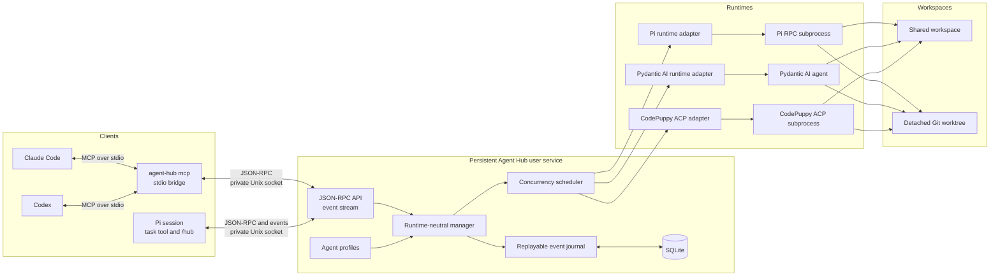

# Agent Hub

Delegate coding work to Pi, Pydantic AI, or CodePuppy from Pi, Claude Code, and Codex.

Agent Hub runs agents in a persistent local service. Your agents keep running when you close an individual Pi session. The service schedules concurrent work, stores lifecycle events in SQLite, and exposes a JSON-RPC API through a private Unix socket.

## Install

```bash
uv tool install git+https://github.com/Kludex/agent-hub.git
agent-hub install
```

`agent-hub install` starts the Agent Hub service and installs the bundled Pi extension. It creates a LaunchAgent on macOS or a user systemd service on Linux.

Restart Pi after the installation. You can then use the `task` tool to delegate work and `/hub` to inspect running agents.

## Connect Claude Code

Create `.mcp.json` in your project:

```json
{
  "mcpServers": {
    "agent-hub-my-project": {
      "command": "agent-hub",
      "args": ["mcp"]
    }
  }
}
```

Restart Claude Code after you create the file. Use a project-specific server name so each project keeps an independent MCP configuration.

## Connect Codex

```bash
codex mcp add agent-hub-my-project -- agent-hub mcp
```

Restart Codex after you add the server.

The MCP bridge uses the client's working directory as the workspace for delegated agents. It connects to the persistent service through the private Unix socket.

The MCP server provides these tools:

| Tool | Purpose |
| --- | --- |
| `task` | Delegate work to an agent profile. |
| `agent_list` | List agents, optionally filtered by state or parent. |
| `agent_get` | Get an agent with its runs and events. |
| `agent_stop` | Stop an agent and its attached descendants. |
| `agent_abort` | Abort the active run for an agent. |
| `run_get` | Get the current state and result of a run. |
| `run_wait` | Wait for a run to finish. |

Run `agent-hub install` before you connect an MCP client. The bridge needs the persistent service to be available.

## Delegate work

Pass a profile name and a complete prompt to the `task` tool:

```json
{
  "agent": "reviewer",
  "prompt": "Review the current changes. Report concrete defects and missing tests.",
  "background": false,
  "isolated": false
}
```

Agent Hub includes the `task`, `scout`, and `reviewer` profiles. You can install more profiles from the catalog or create your own.

Set `background` to `true` when the caller should continue without waiting for the result. Use `run_get` or `run_wait` to inspect the run later.

## Install an agent from the catalog

```bash
agent-hub catalog
agent-hub catalog search planning
agent-hub catalog show agent-hub/implementation-planner
agent-hub catalog install agent-hub/implementation-planner
agent-hub agent list
```

The catalog contains versioned agent profiles. Before installation, Agent Hub verifies the bundle and shows its permissions and external dependencies. Installed versions stay pinned until you update them explicitly:

```bash
agent-hub agent update agent-hub/implementation-planner
```

See [Agent catalog](docs/catalog.md) to configure sources, review permission changes, and publish profiles.

## Create a Pi profile

```bash
mkdir -p ~/.config/agent-hub/agents
cat > ~/.config/agent-hub/agents/reviewer.toml <<'EOF'
name = "reviewer"
runtime = "pi"
model = "anthropic/claude-sonnet-4"
access = "read-only"
keep_alive = false
max_runtime_seconds = 900
EOF
```

User profiles live in `~/.config/agent-hub/agents/`. The `access` field controls whether the agent can modify its workspace. The runtime limit prevents an unattended run from continuing indefinitely.

You can also keep an agent process available between runs:

```bash
cat > ~/.config/agent-hub/agents/persistent-reviewer.toml <<'EOF'
name = "persistent-reviewer"
runtime = "pi"
model = "anthropic/claude-sonnet-4"
access = "read-only"
keep_alive = true
idle_timeout_seconds = 300
max_runtime_seconds = 900
EOF
```

A keep-alive profile must define `idle_timeout_seconds`. This lets Agent Hub release an idle runtime instead of keeping it alive forever.

### Project profiles

```bash
agent-hub install --allow-project-profiles
```

With this option enabled, you can store profiles under `.agent-hub/agents/` in the current project. Project profiles override user profiles with the same name. User and enabled project profiles also override installed catalog profiles with the same `<owner>/<name>` identity.

> [!WARNING]
> Enable project profiles only when you trust the repository. A project can then define the runtime, tools, and access used by an agent profile.

## Create a Pydantic AI profile

```bash
mkdir -p ~/.config/agent-hub/agents
cat > ~/.config/agent-hub/agents/pydantic-coder.toml <<'EOF'
name = "pydantic-coder"
runtime = "pydantic-ai"
model = "anthropic:claude-sonnet-4-6"
access = "shared-write"
tools = ["read_file", "list_files", "write_file"]
mcp_servers = ["https://localhost:8000/mcp"]
allow_delegation = false
max_runtime_seconds = 900

[usage_limits]
request_limit = 30
total_tokens_limit = 100000
EOF
```

The `read_file` and `list_files` tools work with read-only profiles. The `write_file` tool requires `shared-write` access. Usage limits bound the requests and tokens available to the run.

URL and script-based MCP servers require the Pydantic AI MCP optional dependency. If you embed `create_app()`, you can also inject preconfigured MCP toolsets.

Catalog bundles can include a native Pydantic AI `AgentSpec`. Agent Hub builds it with `Agent.from_spec()` while keeping tools, MCP servers, and access controls in `agent.toml`. This keeps permissions visible during catalog review. See [Publish a Pydantic AI AgentSpec](docs/catalog.md#publish-a-pydantic-ai-agentspec) for a complete bundle.

## Create a CodePuppy profile

Install a CodePuppy release with the stable `--acp` interface:

```bash
uv tool install "code-puppy>=0.0.774"
code-puppy --help
```

Configure your model provider in CodePuppy. Agent Hub does not copy or manage CodePuppy credentials.

Then create the profile:

```bash
mkdir -p ~/.config/agent-hub/agents
cat > ~/.config/agent-hub/agents/codepuppy-coder.toml <<'EOF'
name = "codepuppy-coder"
runtime = "codepuppy"
model = "claude-sonnet-4-6"
access = "shared-write"
keep_alive = true
idle_timeout_seconds = 300
max_runtime_seconds = 900
instructions = "Implement the requested change and run the relevant tests."
EOF
```

Agent Hub starts `code-puppy --acp` through the official Agent Client Protocol SDK. It maps text, thinking, tool activity, usage, errors, cancellation, and session loading into the common Agent Hub lifecycle.

A read-only profile rejects write and terminal permissions. An isolated run gives CodePuppy a detached worktree.

CodePuppy cannot receive steering or queued follow-up prompts while an ACP prompt is active. Send the next turn after the current run finishes. CodePuppy also owns its tools and MCP configuration, so `tools` and `mcp_servers` in the Agent Hub profile do not change the CodePuppy agent.

If the service cannot find the executable, reinstall it with an absolute path:

```bash
agent-hub install --codepuppy-executable "$HOME/.local/bin/code-puppy"
```

## Isolate workspace changes

Pass `isolated: true` to the `task` tool:

```json
{
  "agent": "task",
  "prompt": "Implement the requested change and run the relevant tests.",
  "access": "shared-write",
  "isolated": true
}
```

Agent Hub creates a detached Git worktree for the run. The agent can modify that worktree without changing your current checkout. Use `/hub` to inspect the patch, apply it explicitly, or discard the worktree.

Agent Hub never applies isolated changes automatically. This keeps the final merge under your control.

## Run without installing a service

```bash
agent-hub serve
```

The server listens on `~/.agent-hub/run/agent-hub.sock`. It runs Uvicorn with `zttp` for HTTP parsing and `zuvloop` for the event loop. Python clients and tests use `httpx2`.

Use this command when you want to manage the process yourself. The regular installation is persistent and starts with your user session.

## Architecture



The Pi extension transports commands and renders state. The persistent manager owns scheduling, recovery, event replay, and runtime processes. This separation lets agents survive individual client sessions.

## Development

```bash
uv sync
uv run pytest
cd extension
npm install
npm run check
npm test
```

Run the installed Pi process check without contacting a model provider:

```bash
uv run pytest -m installed_pi tests/test_installed_pi.py
```

See [`PLAN.md`](PLAN.md) for the protocol and architecture.

## Uninstall

```bash
agent-hub uninstall
uv tool uninstall agent-hub
```

The first command removes the user service and bundled Pi extension. The second removes the `agent-hub` executable.
